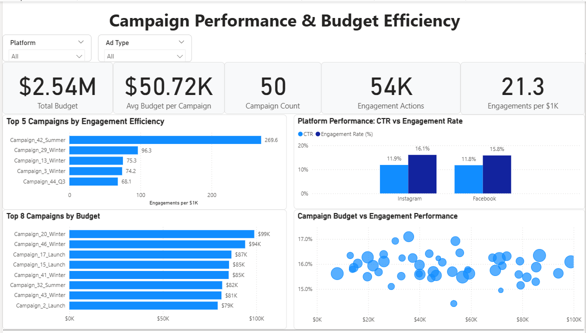
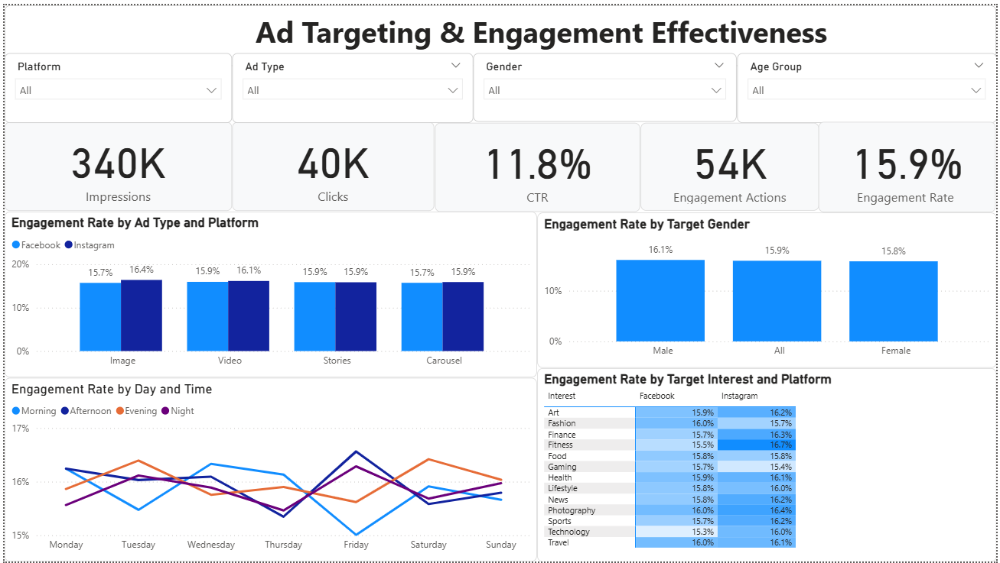
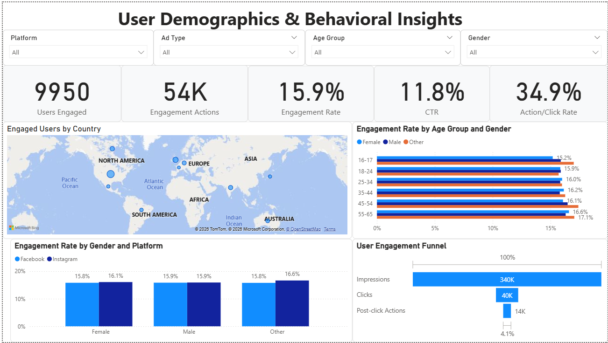

# 📊 Social Media Advertising Performance Analysis

An interactive three-page Power BI dashboard analyzing **50 campaigns, $2.54M in ad spend, and 340K impressions** across Facebook and Instagram. It evaluates campaign budget efficiency, ad targeting effectiveness, and audience behavior.

> Developed as part of a SAIT Business Intelligence capstone, then redesigned and enhanced for portfolio presentation.

---

## 🔑 Executive Summary

- **Spend scales volume, not engagement rate.** Campaigns from under $10K to nearly $100K all landed within roughly 14.5%–17% engagement rate.
- **Efficiency is where campaigns truly differ.**
  - The portfolio averages **21.3 engagements per $1K**.
  - The top campaign reached **269.6**, nearly 13× the average.
  - None of the 8 highest-budget campaigns appear among the 5 most efficient.
- **Reach per dollar drives efficiency, not engagement quality.** Engagement rate is nearly constant across campaigns, so efficiency differences come from how many impressions each dollar buys.
- **Targeting choices show limited separation.** Platform, ad format, gender, interest, and timing all fall within about 1.5 percentage points of each other.
- **About a third of clicks lead to deeper interaction.** 34.9% of clicks resulted in a like or share.

**Recommendation:** Prioritize campaign-level cost efficiency — reach per dollar and creative testing — over demographic targeting, which shows little performance separation. Apply a minimum-spend threshold when ranking campaign efficiency.

---

## 📊 Dashboard 1 — Campaign Performance & Budget Efficiency



**Business questions**
- Which campaigns generate the strongest engagement relative to their budget?
- Which campaigns receive the largest investment?
- How do Facebook and Instagram compare on CTR and engagement rate?
- Does a larger budget lead to higher engagement?

**Key features**
- Total budget, average budget per campaign, and campaign count
- Total engagement actions and engagements per $1K
- Top 5 campaigns by engagement efficiency and top 8 by budget
- Facebook vs Instagram CTR and engagement rate
- Campaign budget vs engagement rate scatter analysis

**Key findings**
- **$2.54M** was invested across **50 campaigns**, an average of **$50.72K** per campaign. These campaigns generated **54K engagement actions**.
- Overall efficiency is **21.3 engagements per $1K**.
- **Campaign_42_Summer leads at 269.6 engagements per $1K.**
  - That is about 2.8× the next-best campaign, Campaign_29_Winter (96.3).
  - It is nearly 13× the portfolio average.
  - An outlier this large likely reflects a small budget base. It should be validated before reallocating spend.
- **Efficiency is concentrated in a few campaigns.** Even the fifth-ranked campaign, Campaign_44_Q3 (68.1), runs at about 3× the portfolio average.
- **The highest-budget campaigns are not the most efficient.** The top 8 by budget ($79K–$99K, led by Campaign_20_Winter at $99K) share no campaigns with the top 5 by efficiency.
- **Budget shows no clear relationship with engagement rate.**
  - Campaigns at every budget level cluster between roughly 14.5% and 17%.
  - Since engagement rate stays flat, efficiency differences are driven by impressions per dollar.
- **Instagram and Facebook perform at near parity:**
  - CTR: 11.9% vs 11.8%.
  - Engagement rate: 16.1% vs 15.8%.

---

## 🎯 Dashboard 2 — Ad Targeting & Engagement Effectiveness



**Business questions**
- Which ad formats generate stronger engagement?
- Does target gender influence engagement performance?
- Which target interests perform better on Facebook vs Instagram?
- Which days and times generate stronger engagement?

**Key features**
- Impressions, clicks, CTR, engagement actions, and engagement rate
- Engagement rate by ad type × platform
- Engagement rate by target gender
- Engagement rate by day of week × time of day
- Target interest × platform heatmap

**Key findings**
- **340K impressions** generated **40K clicks** (11.8% CTR) and a **15.9% engagement rate**.
- **No single ad format dominates.**
  - All format–platform combinations fall between 15.7% and 16.4%.
  - Image on Instagram is highest, at 16.4%.
  - Image and Carousel on Facebook are lowest, at 15.7%.
- **Instagram matches or outperforms Facebook in every ad format.**
  - Its largest lead is on Image (+0.7 percentage points).
  - The two platforms tie on Stories (15.9%).
- **Gender targeting shows minimal separation:**
  - Male-targeted ads: 16.1%.
  - All-gender ads: 15.9%.
  - Female-targeted ads: 15.8%.
  - That is a 0.3-percentage-point spread.
- **Instagram leads Facebook in 10 of 13 interest segments.**
  - The widest gaps are Fitness (16.7% vs 15.5%), Technology (16.0% vs 15.3%), and Finance (16.3% vs 15.7%).
  - Facebook leads only in Fashion (16.0% vs 15.7%) and Gaming (15.7% vs 15.4%), and the two tie on Food (15.8%).
  - The highest interest–platform combination is Instagram Fitness (16.7%); the lowest is Facebook Technology (15.3%).
- **Time of day matters more than day of week.**
  - Friday has both the strongest slot (Afternoon, approximately 16.6%) and the weakest (Morning, approximately 15.0%).
  - Evening engagement peaks on Tuesday and Saturday, at approximately 16.4%.

---

## 👥 Dashboard 3 — User Demographics & Behavioral Insights



**Business questions**
- Which age and gender groups show stronger engagement?
- Does engagement differ between platforms for the same demographic groups?
- Where are engaged users located?
- How effectively do impressions progress to clicks and post-click actions?

**Key features**
- Engaged users, engagement rate, CTR, and action/click rate
- Geographic distribution of engaged users
- Engagement rate by age group × gender
- Engagement rate by user gender × platform
- User engagement funnel

**Key findings**
- **9,950 users** generated **54K engagement actions**, about **5.4 actions per engaged user**.
- **Female engagement rises steadily with age:**
  - 16–17: 15.2%.
  - 25–34: 16.0%.
  - 35–44: 16.2%.
  - 55–65: 16.6%.
- **The "Other" gender group shows the highest engagement** in older age bands, above 17% for ages 45–54 and 55–65. Sample size for this group should be checked before drawing conclusions.
- **Instagram matches or outperforms Facebook for every gender group:**
  - Female: 16.1% vs 15.8%.
  - Male: 15.9% for both.
  - Other: 16.6% vs 15.8%, the largest gap.
- **Funnel:**
  - 340K impressions → 40K clicks → 14K post-click actions.
  - **34.9% of clicks** led to a like or share.
  - Only **4.1% of impressions** reached a post-click action.
- **Geographic reach:** engaged users span approximately 10 countries across North America, South America, Europe, Asia, and Oceania. The United States shows the largest concentration.

---

## 📐 Key Metrics & DAX

### Metric definitions

| Metric | Definition | Value |
|---|---|---|
| Total Budget | Sum of campaign budgets | $2.54M |
| Impressions | Count of impression events | 340K |
| Clicks | Count of click events | 40K |
| CTR | Clicks ÷ Impressions | 11.8% |
| Engagement Actions | Clicks + Likes + Shares | 54K |
| Engagement Rate | Engagement Actions ÷ Impressions | 15.9% |
| Engagements per $1K | Engagement Actions ÷ Total Budget × 1,000 | 21.3 |
| Post-click Actions | Likes + Shares | 14K |
| Action/Click Rate | (Likes + Shares) ÷ Clicks | 34.9% |
| Users Engaged | Distinct users who interacted with ads | 9,950 |

**Metric reconciliation**
- 40K clicks + 14K likes and shares = 54K engagement actions.
- 54K ÷ 340K = 15.9% engagement rate.
- 14K ÷ 40K = 34.9% action/click rate.
- 54K ÷ $2.54M × 1,000 = 21.3 engagements per $1K.

### DAX measures

All rate measures are built on base count measures (`[Impressions]`, `[Clicks]`, `[Likes]`, `[Shares]`, `[Total Budget]`). They use `DIVIDE()` to handle zero denominators safely when slicers filter a segment down to no data.

**Reach and response**

```DAX
CTR =
DIVIDE(
    [Clicks],
    [Impressions]
)
```
*Answers: How often does an impression lead to a click?*

**Engagement**

```DAX
Engagement Actions =
[Clicks] + [Likes] + [Shares]
```
*Answers: How much total interaction did the ads generate?*

```DAX
Engagement Rate (%) =
DIVIDE(
    [Engagement Actions],
    [Impressions]
)
```
*Answers: How engaging are the ads relative to their reach? This measure allows fair comparison across segments of different sizes.*

**Budget efficiency**

```DAX
Engagements per $1K =
DIVIDE(
    [Engagement Actions],
    [Total Budget]
) * 1000
```
*Answers: How much engagement does each $1,000 of spend produce? This is the primary measure for comparing campaign investment efficiency.*

**Funnel depth**

```DAX
Action/Click Rate =
DIVIDE(
    [Likes] + [Shares],
    [Clicks]
)
```
*Answers: Once users click, how often do they interact further?*

These measures let performance be compared on normalized rates rather than raw activity volume.

---

## 🧱 Data Model

The model uses a star schema. It has one event-level fact table and four core dimensions:

| Table | Type | Description |
|---|---|---|
| `FactAdEvents` | Fact | One row per ad interaction (impression, click, like, share) |
| `DimAds` | Dimension | Ad format, platform, and targeting attributes |
| `DimCampaigns` | Dimension | Campaign name, budget, and duration |
| `DimUsers` | Dimension | User age group, gender, country, and interests |
| `DimDate` | Dimension | Calendar attributes for time analysis |

Supporting tables handle time-of-day buckets, interest mapping, and funnel stage ordering.

**Modeling note:** Budget is stored at campaign grain. It is not attributed to individual platforms or ads. When slicing by platform or ad type, **Engagements per $1K** reflects the engagement from that slice against the full budget of the campaigns involved.

---

## 📂 Dataset

**Source:** [Kaggle — Social Media Advertisement Performance](https://www.kaggle.com/datasets/alperenmyung/social-media-advertisement-performance/data)

The dataset covers:
- Advertising campaigns, budgets, duration, and scheduling
- Facebook and Instagram ads, ad formats, and targeting attributes
- User demographics, interests, and geography
- Event-level interactions: impressions, clicks, likes, and shares

---

## ✨ Portfolio Redesign

The original capstone dashboards were rebuilt with an emphasis on analytical depth and presentation quality.

**Analytical enhancements**
- Rate-based KPIs (CTR, engagement rate, action/click rate) in place of raw event counts
- A budget efficiency measure (engagements per $1K)
- An interest × platform heatmap for targeting comparison
- Budget vs engagement scatter analysis
- A user engagement funnel and geographic view
- Demographic comparisons by age, gender, and platform

**Design enhancements**
- Consistent KPI cards, slicers, and formatting across all three pages
- Cleaner layouts with reduced chart clutter and redundant legends
- Chronological sorting for day and time analysis

---

## ⚠️ Limitations

- Segment-level engagement rates are tightly clustered, so most differences are within normal variation. Findings are directional; statistical testing would be needed before acting on them.
- Efficiency rankings are sensitive to small budgets. A minimum-spend threshold would make comparisons more reliable.
- Smaller segments, such as the "Other" gender group, may have limited sample sizes.
- Budget cannot be allocated below campaign level, which limits platform-level cost analysis.
- The dataset contains no conversion or revenue data, so ROI and ROAS cannot be calculated.

---

## 🛠️ Tools & Technologies

- **Power BI Desktop:** data modeling and dashboard development
- **Power Query:** data cleaning and transformation
- **DAX:** calculated measures and KPIs
- **Star schema modeling:** relationships and filter context design

**Skills applied:** KPI design, marketing and campaign analytics, audience segmentation, dimensional modeling, and data storytelling.

---

## 📁 Repository Structure

```
social-media-advertising-powerbi-analysis/
├── dashboard/
│   └── Social_Media_Ads_Analysis.pbix
├── images/
│   ├── 01_campaign_performance_budget_efficiency.png
│   ├── 02_ad_targeting_engagement_effectiveness.png
│   └── 03_user_demographics_behavioral_insights.png
├── LICENSE
└── README.md
```

---

## ▶️ How to View

**Quick view (no install):** see the dashboard screenshots above.

**Interactive:**
1. Download [`Social_Media_Ads_Analysis.pbix`](dashboard/Social_Media_Ads_Analysis.pbix).
2. Open it in Power BI Desktop (free).
3. Use the **Platform, Ad Type, Gender, and Age Group** slicers to explore segments, and hover over visuals for detailed tooltips.

---

## 👤 Author

**Harshit Patel**
[LinkedIn](https://www.linkedin.com/in/harshitpatel0603) · [GitHub](https://github.com/Harry4ds) · [Medium](https://medium.com/@harshitpatel4ds)

*Dataset used for educational and portfolio purposes.*
